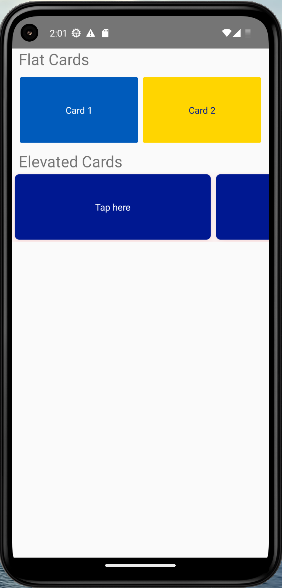

# My React Native Project

## Description
This is a React Native project that I created to learn the basics of React Native.  

`This Project will be updated as I learn more about React Native.`

## The Basic Style (Lesson 1)
This is the basic style of the project.  

## Credits
* [ivandjoh](https://linkedin.com/in/ivandjoh)
* [delvin](https://github.com/delvincakep)
